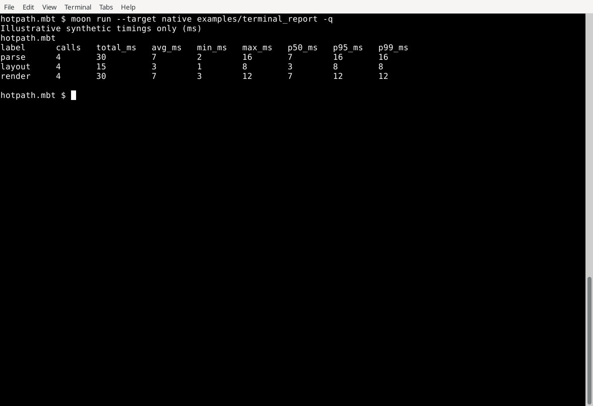

# hotpath.mbt

MoonBit-first application profiling toolkit inspired by [pawurb/hotpath-rs](https://github.com/pawurb/hotpath-rs).

The runtime provides portable explicit scoped timing, deterministic aggregation, bounded distribution statistics, snapshots, merge/reset hooks, and text reports. CPU/allocation sampling is intentionally left to profilers such as `moon-pprof`; future hotpath.mbt tooling will correlate those samples with application-level instrumentation.

## Installation

Add version 0.2.1 of the module:

```sh
moon add f4ah6o/hotpath@0.2.1
```

Import the `src` package in the consuming package's `moon.pkg`:

```moonbit
import {
  "f4ah6o/hotpath/src" @hotpath,
}
```

## Quick start

```moonbit
let profiler = @hotpath.Profiler::new()

let value = profiler.measure("parse", fn() {
  // work
  42
})

profiler.measure("render", fn() {
  // more work
  ()
}) |> ignore

println(profiler.render_text())
```

For deterministic tests or a target-specific high-resolution clock, inject a clock:

```moonbit
let tick = Ref::new(0L)
let now = fn() {
  let current = tick.val
  tick.val = current + 10L
  current
}

profiler.measure_with("fake", now, fn() { () }) |> ignore
```

Durations are currently stored in milliseconds. The default clock uses `moonbitlang/core/env`. The aggregation core is clock-independent, so platform-specific monotonic adapters do not change the aggregate model.

### Opt-in nanosecond measurements

For sub-millisecond application spans, use the separate `ProfilerNs` facade.
The original `Profiler`, millisecond fields and report format are unchanged.

```moonbit nocheck
let profiler = @hotpath.ProfilerNs::new()
let value = profiler.measure_ns_with("input.handle", monotonic_now_ns, () => work())
println(profiler.render_text())
```

`measure_ns_with` accepts caller-supplied nonnegative monotonic nanosecond
timestamps; check the source clock's actual resolution and bound the label
vocabulary. Native builds also provide `measure_native_ns` and
`native_clock_resolution_ns()`. POSIX targets use `clock_gettime(CLOCK_MONOTONIC)`
and `clock_getres(CLOCK_MONOTONIC)`; Windows uses
`QueryPerformanceCounter` and `QueryPerformanceFrequency`. The clock has an
arbitrary origin and is independent of wall-clock adjustments; suspend behavior
is defined by the operating system. Nanoseconds are the storage unit; neither
API promises nanosecond accuracy or resolution. The native adapter is available
on Linux, macOS, and Windows, and is omitted on JavaScript targets.
Backward/invalid clocks omit samples and increment `invalid_clock_samples`.
`record_ns` rejects negative values. Totals saturate at Int64 maximum with an
explicit `total_saturated` flag; excess calls at Int maximum are dropped and
reported by `dropped_samples`. Reset clears data and diagnostics. Histogram
percentiles remain bounded estimates. `ProfilerNs` is synchronous, not
thread-safe, and does not retain raw samples, install a clock or subtract its
instrumentation overhead. Capture bounded raw samples in the calling harness
and measure that overhead separately when evaluating a regression.

Each label also owns a fixed 64-counter logarithmic histogram. Distribution memory is therefore bounded independently of observation count. `p50_ms`, `p95_ms`, and `p99_ms` are deterministic bucket estimates capped by the observed maximum; raw samples are never retained. `Profiler::merge` combines both aggregate counters and histogram buckets while preserving deterministic label order.

## Current scope

- explicit scoped timing via `Profiler::measure`
- injectable clock via `Profiler::measure_with`
- repeated-label aggregation
- nested measurements
- calls / total / min / max / integer average
- bounded p50 / p95 / p99 estimates
- deterministic profiler merge
- stable insertion-order snapshots and text reports
- deterministic reset/test hooks
- M0-vs-M1 native micro-benchmark in CI
- native monotonic nanosecond adapter and clock/measurement overhead benchmarks

Not yet implemented: source rewriting for `#hotpath.measure`, CPU/allocation correlation, JSON/Prometheus, CI regression policy, MCP, and HTTP/I/O/channel/lock adapters. These are tracked as repository-local design packets under `issues/`; GitHub Issues are intentionally not used.

## Terminal report example

The current text output is a compact, deterministic, tab-separated snapshot from `Profiler::render_text()`. It is not an interactive hotpath-rs-style terminal dashboard: there is no live TUI, CPU/allocation sampler, thread view, or boxed table yet.

Run a small example that prints the existing public API's report:

```sh
moon run --target native examples/terminal_report -q
```

The example feeds fixed synthetic millisecond durations through `record_ms`, so its output is reproducible and illustrative only; it is not a measurement of the example's execution time. The `p50_ms`, `p95_ms`, and `p99_ms` columns are bounded estimates from the fixed logarithmic histogram. Raw observations are not retained, so these are not exact percentiles computed from a stored sample list.

The screenshot below is an unedited capture of the cloud terminal window running this command. Only terminal tab stops were adjusted for readability (`tabs 12,20,31,40,49,58,67,76,85`); the rendered report headers and values are unchanged.



## Development

```sh
moon check --target all
moon test --target all
moon bench --target native
moon fmt --check
```

Issue packets move through `issues/open/`, `issues/polished/`, and `issues/done/`. See `issues/polished/0002-production-roadmap.md` for the production-ready roadmap.

## License

Licensed under the Apache License, Version 2.0. See [LICENSE](LICENSE).

## Versioned native releases

Edit the `version` field in `moon.mod` to the intended SemVer version
(e.g., `0.2.0` to `0.2.1`) and merge that change into `main`.
The release workflow compares the previous and new **version values**, not
just the file modification date. On a version increase it validates
version consistency, builds four native platforms, then creates the
immutable `vX.Y.Z` tag and GitHub Release for the matching commit.
Other changes to `moon.mod` do not publish. Version downgrades fail.

An explicitly pushed `vX.Y.Z` tag remains supported only when the tag
matches `moon.mod`; the workflow never edits source versions or bumps
versions on its own. Publishing requires successful binary builds and
GitHub Actions permission to create a Release.

The native example assets are named `hotpath-report-linux-x86_64`,
`hotpath-report-linux-aarch64`, `hotpath-report-darwin-aarch64`, and
`hotpath-report-windows-x86_64.exe`. The Mooncakes library remains a separate dependency.
